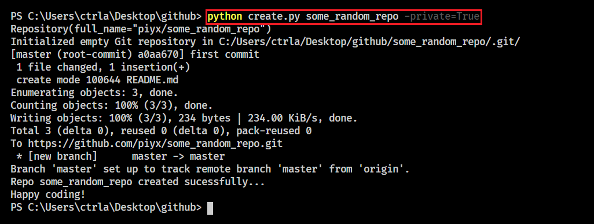
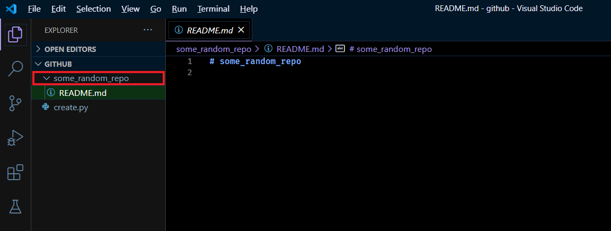

# create_repo
Create repo directly from command line


## Usage
`Note: This will create repo in the same folder from where its run.`  
`python create.py <repo_name> [-private]`

```
positional arguments:
  repo_name         A name for new repo

optional arguments:
  -h, --help        show this help message and exit
  -private PRIVATE  Set private to True for private repo [default=False]
```

## How to get the token?
Visit https://docs.github.com/en/free-pro-team@latest/github/authenticating-to-github/creating-a-personal-access-token


## Example
`python create.py some_random_repo -private=True`

## Pics



## Result
