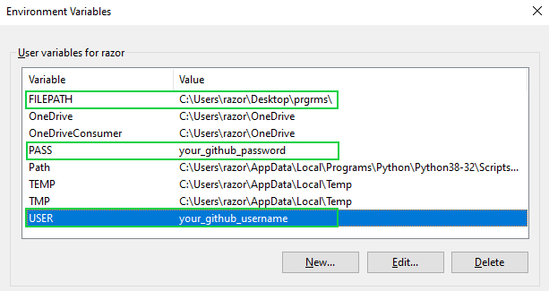

# create-repo-automatically

## How to use
1.Download create.exe  
2.Set environment variables  
3.Open cmd prompt in the location where create.exe was downloaded  
4.Type "create github_repo_name" in cmd  
5.This will create a repository and create a folder in the path specified in environment variables  

## How to set environment variables

