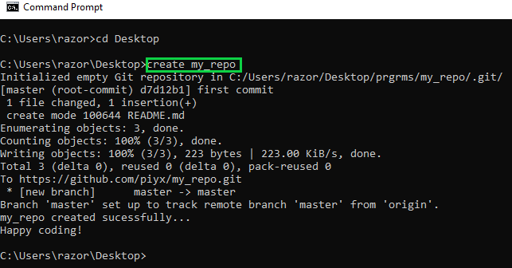
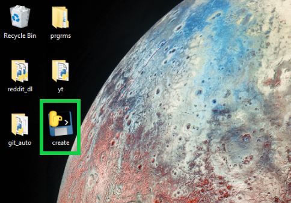
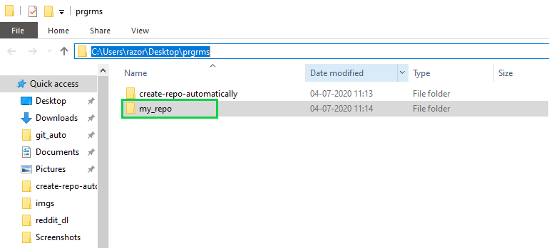
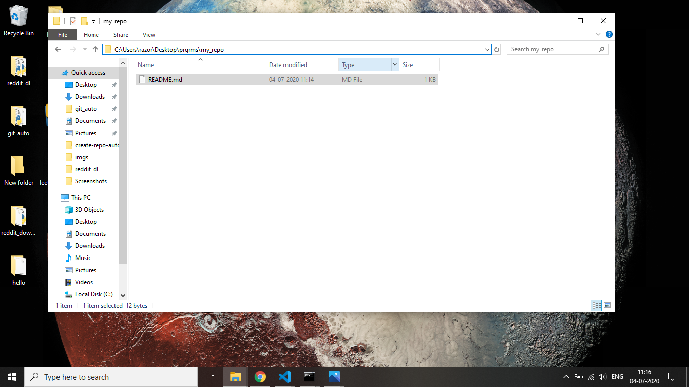
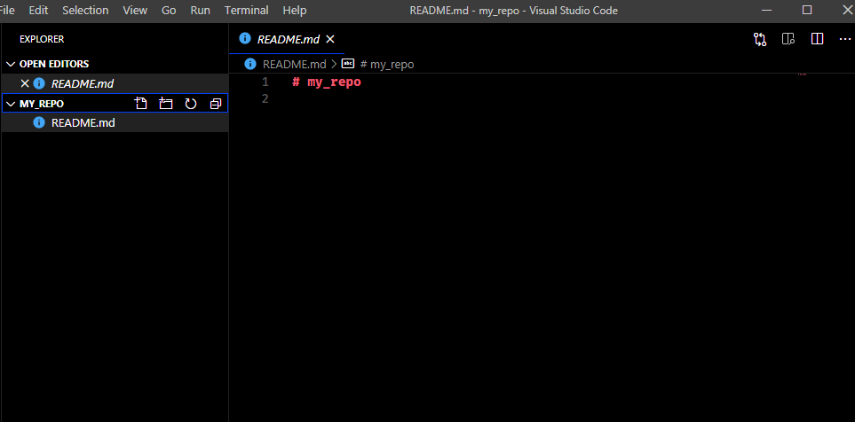

# create-repo-automatically  

### Works only for WINDOWS  

## How to use
1.Download create.exe (https://github.com/piyx/create-repo-automatically/raw/master/create.exe)  
2.Set environment variables  
3.Open cmd prompt in the location where create.exe was downloaded  
4.Type "create github_repo_name" in cmd  
5.This will create a repository and create a folder in the path specified in environment variables  

## How to set environment variables

### Create 3 varibles  
1.FILEPATH - path where you want your repo folder to be created  
2.USER - your github username  
3.PASS - your github password  

## How to run

  

1.Open cmd where create.exe is located  
2.Type "create your_repo_name"

That's it!!

## Screenshots

  
#### -File create.exe in Desktop (You can put it anywhere you want)  

  
#### -Folder created in path  

  
#### -Inside repo folder  

  
#### -Visual studio code opens and you can start coding immidiately
