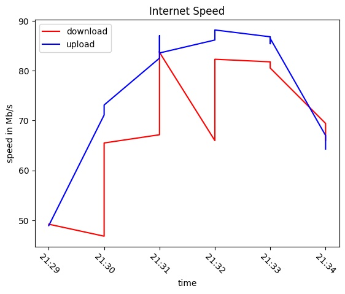

# speed-test
Monitor wifi speed

## Install packages
`pip install speedtest-cli`

## Usage
1. Run `python test.py`  
It creates monitor.csv file and adds all readings to it  
Let it run for a while  

2. Run `python graph.py`    
Outputs a graph as an image  

## Example

