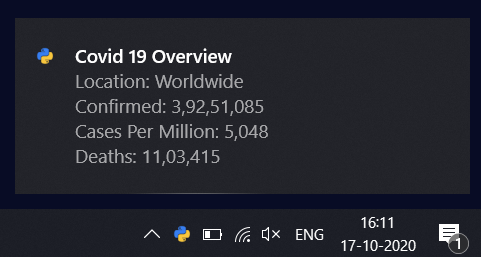
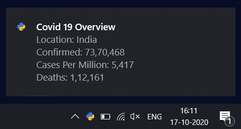
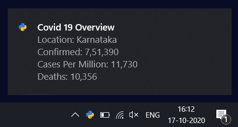

# covid19
Get covid 19 notifications on number of cases worldwide, in country and state.

## Packages

`pip install win10toast`

## Run

`python covid.py`

## Output

### WorldWide

### India

### Karnataka

